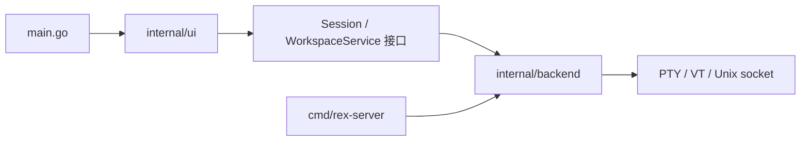

# Rex / Keel 原生终端

`github.com/dyike/keel-rex` 是使用 Keel / Gio 构建的 macOS 终端 App。0.3.x 参考 [GoRex](https://github.com/egoist/gorex) 补齐工作区恢复、命令搜索、标签操作和键盘导航，保留真实 PTY、Git 操作与原生 NSWindow 交通灯。

直接打开 `dist/Rex Keel.app`，或在项目目录运行：

```sh
keel run -- -dir /path/to/project
```

## 使用

每个终端连接独立的登录 shell，可以运行 Vim、SSH、Codex 和其他命令。左右、上下和嵌套分栏都可拖动分隔条调整大小，悬停或拖动时显示深灰色手柄，平时隐藏；双击分隔条恢复等分。点击面板标题切换焦点，右侧按钮用于分屏、放大和关闭。

内部按钮使用与 GoRex 同源的 Lucide SVG，程序标识使用 Simple Icons。工具栏、Git 操作、右键菜单和命令面板保持一致，支持浅色、深色与 Retina；悬停显示底色，面板放大后切换为还原符号。

终端支持系统中文输入法：选词前的拼音和候选文字显示在光标处，确认后将最终文字发送给当前程序。候选框跟随终端光标，Codex、Claude Code 等备用屏幕程序使用相同输入路径。

标签随数量增加自动缩窄，不显示横向滚动条；支持拖动排序、双击重命名和右键菜单。名称留空时跟随当前程序或目录；标签图标显示该工作区的面板，当前面板在最前。绿色圆点表示最近有输出，橙色圆点表示后台程序结束或响铃后等待查看。

⌘ 按钮打开命令面板，模糊搜索所有动作和已打开面板。方向键选择、Enter 执行、Esc 关闭；关闭后键盘焦点回到终端。目录输入支持 `~`，无效路径会显示错误。

终端支持 ANSI 样式、备用屏幕、最多 10000 行历史、中文输入和显示。滚轮查看历史，按住鼠标拖选时可用滚轮继续跨屏扩选，双击选词、三击选行，⌘A 选中保留的历史和当前屏幕，⌘C 复制、⌘V 粘贴。TUI 的鼠标协议收到左右键、修饰键和滚轮；按 Shift 可以改为选择文本。⌘F 查找终端和历史中的文本，再次查找会前进到下一处并循环。

Git 面板显示当前仓库的状态和 diff，支持暂存、取消暂存、暂存全部和提交。长路径单行截断，代码按原始行显示，Tab 展开为空格，两个方向均可滚动。提交失败时保留输入；提交只包含已暂存内容。

原生菜单和命令面板提供浅色、深色、跟随系统和字号设置。点击主机名称查看型号、芯片、内存、系统版本与会话服务。系统通知默认关闭；在命令面板选择 `Enable system notifications` 后请求权限，后台响铃或程序结束可通知，点击通知返回对应面板。

| 快捷键 | 操作 |
| --- | --- |
| ⌘T | 新建标签 |
| ⌘D / ⇧⌘D | 左右 / 上下分屏 |
| ⌘W / ⇧⌘W | 关闭面板 / 标签 |
| ⇧⌘Enter | 放大 / 恢复面板 |
| ⌥⌘方向键 | 切换焦点 |
| ⌃⌘方向键 / ⌃⌘= | 调整分隔条 / 等分 |
| ⌘1…⌘9 | 切换标签，⌘9 到最后一个 |
| ⇧⌘[ / ⇧⌘] / ⌃Tab | 前后切换标签 |
| ⇧⌘R | 重命名标签 |
| ⇧⌘P / ⌘P | 命令面板 |
| ⌘O / ⌘F / ⌘K | 打开目录 / 查找 / 清屏与历史 |
| ⌘= / ⌘+ / ⌘− / ⌘0 | 增大 / 增大 / 缩小 / 重置字号 |
| ⌥⌘Q | 确认结束所有会话并退出 |
| Ctrl+C / Ctrl+D | 交给前台程序：中断 / EOF |

## 代码结构

UI 和后端分别位于 `internal/ui`、`internal/backend`。UI 对象保存焦点、选区、输入法和绘制缓存，通过 `Session`、`WorkspaceService` 接口操作后端；PTY、仿真器、锁和 Unix socket 由后端对象封装。后端通过订阅通道报告状态变化，UI 在自己的事件循环中安排重绘。

| 位置 / 对象 | 职责 |
| --- | --- |
| `main.go` | 解析启动参数，选择桌面或兼容的 `-server` 模式 |
| `internal/ui` 的 `app`、`terminal` | 工作区、交互、菜单和终端绘制 |
| `backend.Service` | 创建 / 接回会话、保存布局、查询状态和管理服务 |
| `backend.Session` | 统一的本地 / 远程会话接口：输入、屏幕、搜索、复制和生命周期 |
| `backend.Repository` | Git 查询、操作和文件预览 |
| `backend.HostInspector`、`SettingsStore` | 主机信息读取和设置文件存储 |
| `cmd/rex-server` | 独立服务入口，构建依赖中不包含 Gio 或 Keel UI |



Go 使用结构体的方法封装对象，通过接口和组合组织职责。`ui.Options.Service` 可以注入服务实现；UI 测试使用模型替身或真实 PTY，无需访问后端私有字段。

`go run .` 继续自动启动同一可执行文件的 `-server` 模式。需要独立服务时，构建服务并指定其路径；目录参数继续决定会话和布局存放位置：

```sh
go build -o dist/rex-server ./cmd/rex-server
KEEL_REX_SERVER="$PWD/dist/rex-server" go run . -dir /path/to/project
```

也可以先手动运行服务，再让桌面连接同一个目录：

```sh
./dist/rex-server -state-dir /tmp/rex-separated-state
# 在另一个终端运行：
go run . -state-dir /tmp/rex-separated-state
```

本次拆分保持会话协议和布局格式，已有服务可继续连接。

## 会话恢复

点击左上角主机按钮可查看型号、芯片、内存、系统、用户，以及会话服务器的 PID、运行时长和会话统计。浮层打开时每秒刷新状态；会话总数来自服务器，包含未显示在当前窗口中的会话。旧版服务器继续保留现有会话，浮层标注当前窗口计数；服务器下次启动后提供总数。使用 `-ephemeral` 时显示本地会话状态，并说明退出 App 会结束会话。

关闭窗口或正常退出 App 会保存标签顺序、名称、分屏比例、焦点和放大状态。PTY 和终端仿真运行在后台服务进程中，默认由同一可执行文件的 `-server` 模式启动，也可使用独立的 `rex-server`；重新打开会接回原来的 shell、环境变量和正在运行的备用屏幕程序。

关闭面板或标签会结束对应会话，前台有程序运行时先确认。需要全部结束时使用 `Quit and end all sessions`。结束后的面板提供 Restart；服务断开也可重建 shell。

状态位置：

- 打包 App：`~/Library/Application Support/Rex Keel/`。
- `go run` 开发版：`~/Library/Application Support/Rex Keel Dev/`。
- `KEEL_REX_DIR` 或 `-state-dir` 可指定独立目录；`-ephemeral` 禁用持久服务。

目录中保存 `layout.json`、`settings.json`、私有 Unix socket 和服务日志。正常退出恢复进程；机器重启或服务进程结束后，只能按保存布局在原目录创建新 shell。开发构建不会自动结束已有服务；协议不兼容时会提示先明确结束会话。

如果启动时报 `session server protocol differs`，说明后台服务仍在使用旧协议。需要保留旧会话时，可用独立目录启动新版：

```sh
go run . -state-dir "$HOME/Library/Application Support/Rex Keel Dev-v2"
```

确认旧会话可以结束后，执行以下命令，再重新运行 `keel run`。该操作会结束旧服务中的所有 shell 和前台程序，并清空保存的工作区布局：

```sh
go run . -end-sessions
```

若启动时使用了 `KEEL_REX_DIR` 或 `-state-dir`，结束会话时也应指定同一个目录。

## 开发与验证

需要 Go 1.26 和 Xcode Command Line Tools，Keel 和终端依赖版本由 `go.mod` 管理。macOS 的 `keel run` 使用带图标资源的临时应用包，退出时清理；热重载和 `-watch=false` 使用同一启动方式。

`go tool keel` 使用 `go.mod` 固定的 CLI 版本。本地修改 Keel CLI 后，在 Keel 仓库执行 `go install ./cmd/keel`，再在本项目运行 `keel run`。

```sh
go test -race ./...
go vet ./...
python3 tools/qa_workspace.py
REX_QA_STANDALONE_SERVER=1 REX_QA_DIR=/tmp/rex-qa python3 tools/qa_workspace.py
go tool keel build -target darwin -arch arm64 -o dist
```

`REX_QA_STANDALONE_SERVER=1` 让回归脚本构建并使用独立服务；`REX_QA_DIR` 指定截图输出目录。UI 回归测试位于 `internal/ui`，PTY、通信和性能测试位于 `internal/backend`；依赖回归测试会阻止独立服务引入 UI 包。

回归脚本使用 Keel 的内存窗口，在隔离目录启动会话服务和临时 Git 仓库，结束后清理。它检查命令面板与焦点、中文、分屏、导航、关闭确认、历史查找、实际 Git 暂存和提交，以及关闭再打开的恢复。不会显示 AppKit 测试窗口，也不操作你正在使用的会话或仓库。

PTY 测试另覆盖 Ctrl+C、尺寸同步、ANSI、备用屏幕、会话隔离、Vim 保存中文、大段输入、服务重连和布局恢复。截图：[浅色](evidence/gorex-light.png)、[深色](evidence/gorex-dark.png)、[历史查找](evidence/gorex-search.png)、[恢复会话](evidence/gorex-restored.png)。内存截图不包含系统绘制的交通灯；原生菜单与通知需要在实际 App 中使用。

终端使用 [creack/pty](https://github.com/creack/pty) 和 [Charmbracelet VT](https://github.com/charmbracelet/x/tree/main/vt)。字体加载当前 Mac 的 Menlo、Helvetica Neue 和可用的 PingFang，未分发 Apple 字体。当前没有内建 SSH 连接管理或终端图片协议；SSH 可直接在 shell 中运行。

原始视觉参考：[Rex public testing beginning](https://www.superlogical.com/updates/public-testing-beginning)。包图标使用文章公开的 `rex-icon.png`；UI 图标使用矢量绘制，交通灯使用 AppKit 原生控件。Rex / Superlogical 标识属于原作者。`design-qa.md` 中的旧截图记录保留历史实现，不代表当前终端内容。
